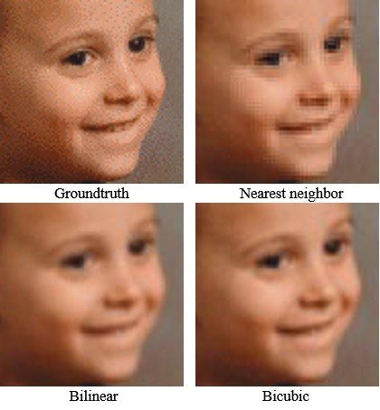
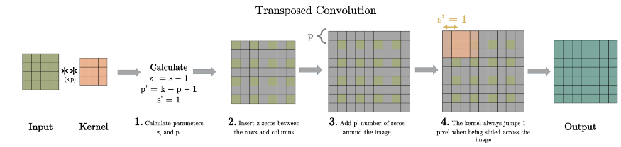

# Computer Vision

## Preprocessing Data
After the cleaning the dataset these were distribution of training vs testing
* Training Dataset size = 5901 (80% )
* Test Dataset size = 1477 (20%)

To create High Resolution Images the original images were cropped to size of 96x96 and to for the lower resolution images they were resized to 48x48 and then resized using upscaling factor of 2 to 96x96 using Bicubic or Bilinear or Nearest Neighbours interpolation method. The RGB image was converted into YCbCr which has shown better results than direct training on RGB data. For training purposes high resolution images were randomly cropped and for testing centre crop was evaluated.

## Super-Resoulution CNNs

### Model Architecture
1. One 9x9 ,stride of 1 and padding 4 Convolution
2. Two 5x5 , stride of 1 and padding of 2 Convolution layer
3. ReLU as activation fucntion.

### Hyperparameters
* Optimizer: Adam
* Learning rate: First two Convolution layers 0.0001 (1e-4) and last layer with 0.00001(1e-5)
* Epochs: 100
* Training batch size = 64
* Test batch size = 32
* Scale = 2

### Evaluation Metric
Bicubic Interpolation
* Peak Signal to Noise Ratio (PSNR)

* Loss function : Mean Squared Error

Both the evaluation metrics were logged using tensorboard can be found in the notebook.

Maximum PSNR value was **33.69 dB** in 100 Epochs of training.

## Super-Resolution ResNet

### Model Architecture
1. Initial 9x9 ,stride of 1 and padding 4 Convolution
2. 4 ResNet Blocks where each Block has 2 Convolution layer of 3x3 kernel and stride of 1,padding of 1 with an activation function of PReLU and 2 layers of BatchNorm
3. Second Convolution block with 3x3 kernel with stride as 1 and padding as 1 and BatchNorm Layer
4. Upsampling block has convolution layer of 3x3 kernel, pixel shuffle of 2 and activation function as PReLU

### Hyperparameters
* Optimizer: Adam
* Learning Rate: 0.0001 (1e-4)
* Epochs: 100
* Training Batch size: 16 
* Test Batch size: 8
* Scale = 2
    
### Evaluation Metric

* Peak Signal to Noise Ratio (PSNR)

* Loss function : Mean Squared Error

Both the evaluation metrics were logged using tensorboard can be found in the notebook.

Maximum PSNR value was **34.62 dB** in 100 Epochs of training.

## Comparison of the performance of different interpolation methods

| Models    | Interpolation Mode | PSNR(dB)  |
| ----------| :-----------------:| ---------:|
| SRCNN     | Bicubic            |**33.69**  |
| SRCNN     | Bilinear           |  33.53    |
| SRCNN     | Nearest            |  32.67    |
| SRResNet  | Bicubic            |**34.62**  |
| SRResNet  | Bilinear           |  34.54    |
| SRResNet  | Nearest            |  33.31   |

It is clearly visible that Bicubic Interpolation mode gives better quality of image. Nearest Neighbour PSNR values are also significantly low as comapred the other two and image also shows that it suffers from checkerd phenomenon. Bicubic and Bilinear appear to be similar and so do their PSNR values but Bicubic is slightly better than Bilinear.

## Comparison of Some Other Upsampling methods

* Transpose Convolution : It is reverse of Convolution also referred as deconvolution. It is learnable upsampling method. The steps invovled in transpose convolution is in the image below. 

* Sub-pixel Convolution : Implemented in SRResNet. As we introduced zeros in Transpose Convolution this causes issue in backpropagation as no information can be backpropagated therefore it is attempted to add some values. To overcome this problem sub-pixel convolution is used. In Sub-pixel Convolution there is an regular convolution layer followed by a pixel shuffle in such a way before pixel shuffle the image is HxWx(Cxrxr) changes to (rxH)x(rxW)xC

* Max Unpooling : In this method we store the index of maximum value while pooling then use that index for max-unpooling where that indes has the pixel value and rest being zero. This is not learnable sampling method.

## Recent Evaluation Metrics

* SSIM (Structural Similarity Index) : This is a perceptual metric that quantifies image quality. 

* Feature Loss or Perceptual Loss : This is computed by comparing two images based on high level representation using a pre-trained model. A recent example of this can be DISQ [ (Deep Image Super-resolution Quality) ](https://arxiv.org/pdf/2012.08732.pdf) which is trained on database SISAR.

* Super-resolution Quality Criterion (SRQC) : A recently proposed evaluation metric in 2020. SRQC benchmark evaluates the quality score of a super resolved image according to the perceptual concepts of low-level spatial features in high sharpness space and curvelet based quality-aware features from focal energy bands, which can be used to capture the quality preservation of an SR image. [Article](https://link.springer.com/article/10.1007/s11042-020-09352)

Recently a lot of novel performance evaluation metrics are being proposed.
