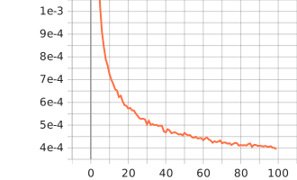

# Computer Vision

## Preprocessing Data
After the cleaning the dataset these were distribution of training vs testing
* Training Dataset size = 5901 (80% )
* Test Dataset size = 1477 (20%)

To create High Resolution Images the original images were cropped to size of 96x96 and to for the lower resolution images they were resized to 48x48 and then resized using upscaling factor of 2 to 96x96 using BICUBIC interpolation method. The RGB image was converted into YCbCr which has shown better results than direct training on RGB data. For training purposes high resolution images were randomly cropped and for testing centre crop was evaluated.

## Super-Resoulution CNNs

### Model Architecture
1. One 9x9 ,stride of 1 and padding 4 Convolution
2. Two 5x5 , stride of 1 and padding of 2 Convolution layer
3. ReLU as activation fucntion.

### Hyperparameters
* Optimizer: Adam
* Learning rate: First two Convolution layers 0.0001 (1e-4) and last layer with 0.00001(1e-5)
* Epochs: 100
* Training batch size = 64
* Test batch size = 32
* Scale = 2

### Evaluation Metric
* Peak Signal to Noise Ratio (PSNR)

* Loss function : Mean Squared Error

Both the evaluation metrics were logged using tensorboard can be found in the notebook.

Maximum PSNR value was 33.69 dB in 100 Epochs of training.

## Super-Resolution ResNet

### Model Architecture
1. Initial 9x9 ,stride of 1 and padding 4 Convolution
2. 4 ResNet Blocks where each Block has 2 Convolution layer of 3x3 kernel and stride of 1,padding of 1 with an activation function of PReLU and 2 layers of BatchNorm
3. Second Convolution block with 3x3 kernel with stride as 1 and padding as 1 and BatchNorm Layer
4. Upsampling block has convolution layer of 3x3 kernel, pixel shuffle of 2 and activation function as PReLU

### Hyperparameters
* Optimizer: Adam
* Learning Rate: 0.0001 (1e-4)
* Epochs: 100
* Training Batch size: 16 
* Test Batch size: 8
* Scale = 2

### Evaluation Metric
* Peak Signal to Noise Ratio (PSNR)

* Loss function : Mean Squared Error

Both the evaluation metrics were logged using tensorboard can be found in the notebook.

Maximum PSNR value was 34.62 dB in 100 Epochs of training.

