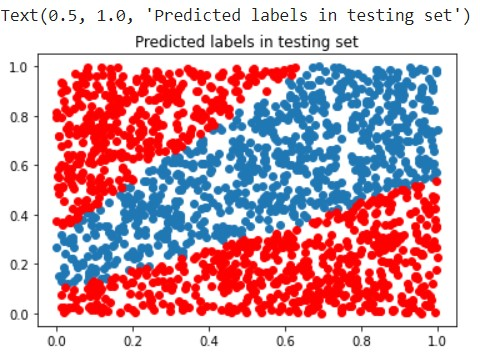

# Core ML Assignment
## Bayesian Neural Network for Noisy XOR using Markov Chain Monte Carlo

PyMC3 a bayesian inference python library which integrates with Theano deep learning Library

* Total size of dataset  = 7000
* Size of Training  dataset = 5250
* Size of Test dataset = 1750

Neural Network Architecture 

Input dimmension = 2
Hidden layer = 2
Output = 1

Markov Chain Monte Carlo sampling : No-U-Turn-Sampler

Sampled for 50000 and fine-tuned for 2000 while training

For ensembling sampled = 5000 

Final accuarcy  = 77.77%

Below is comparison of predicted lables vs actual lables of data.

